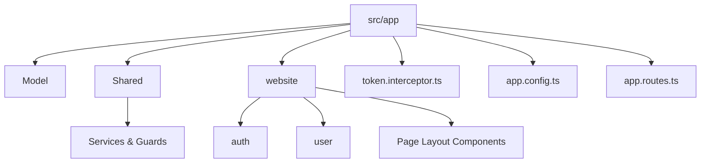
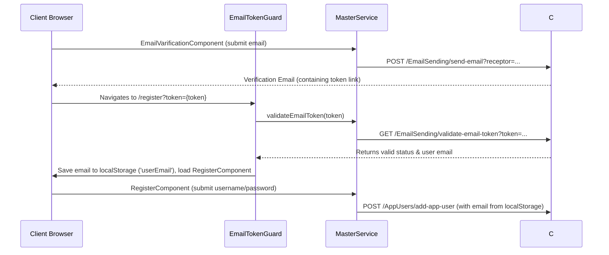

# CODEBASE_GUIDE.md - Senior Developer's Architectural Blueprint

This document provides a comprehensive review of the FitMind-Forum (UI name: **FitJoin**) client-side Angular codebase. It is designed to help engineers quickly understand the system's architecture, key components, data flow patterns, coding standards, and identified areas of technical debt.

---

## 1. Project Overview & Tech Stack (Frameworks aur tools kya hain)

The application is a fitness-themed community forum where users can register, post, draft, categorize, and react to fitness-related threads. It is built as a modern Single Page Application (SPA) leveraging server-side rendering for optimization.

### Core Frameworks & Tooling
*   **Frontend Core:** Angular v19 (specifically using Angular 19.1.x and 19.2.x dependencies). It implements **Standalone Components** throughout the application for a lightweight modular structure.
*   **Rendering Strategy:** Angular Server-Side Rendering (SSR) is enabled via [@angular/platform-server](file:///E:/Angular/FitMind-Forum/package.json#L22) and [@angular/ssr](file:///E:/Angular/FitMind-Forum/package.json#L24) to support client hydration (`provideClientHydration` with `withEventReplay()`).
*   **UI Components & styling:**
    *   **Bootstrap 5 (v5.3.3):** Used for layout grid, modals, responsive navigation, utilities, and components.
    *   **Angular Material & CDK (v19.2.1):** Used specifically for notifications ([MatSnackBar](file:///E:/Angular/FitMind-Forum/src/app/Shared/snack-bar-service.service.ts#L2)) and form styling ([MatFormFieldModule](file:///E:/Angular/FitMind-Forum/src/app/website/user/profile-setting/profile-setting.component.ts#L15), [MatInputModule](file:///E:/Angular/FitMind-Forum/src/app/website/user/profile-setting/profile-setting.component.ts#L14)).
    *   **Ng-Select (v14.7.0):** Provides custom search/dropdown menus for tags/category mapping.
*   **State & Reactive Utilities:**
    *   **RxJS (v7.8.0):** Handles event handling and data streams, specifically using behavior subjects for authentication state and user photos.
    *   **Crypto-JS (v4.2.0):** Present in the codebase for potential security/encryption operations on sensitive strings (e.g., token or ID hashing).
*   **Testing Infrastructure:**
    *   **Jasmine & Karma:** Configuration files ([tsconfig.spec.json](file:///E:/Angular/FitMind-Forum/tsconfig.spec.json)) are set up for unit testing.

---

## 2. Architecture & Folder Structure (Kaun sa folder kis cheez ke liye hai)

The application separates concerns by dividing components, models, and shared utilities into logical blocks under the [src/app](file:///E:/Angular/FitMind-Forum/src/app) directory:



### Folder Breakdown

*   **[Model](file:///E:/Angular/FitMind-Forum/src/app/Model):** Contains type mappings and data transfer objects (DTOs) representing payloads exchanged with the backend API.
    *   [AppUsers.ts](file:///E:/Angular/FitMind-Forum/src/app/Model/AppUsers.ts): User-related profiles (`AppUser`, `UserLoginDTO`, `PublicAppUserDTO`, etc.).
    *   [AddPost.ts](file:///E:/Angular/FitMind-Forum/src/app/Model/AddPost.ts) / [UpdatePostDTO.ts](file:///E:/Angular/FitMind-Forum/src/app/Model/UpdatePostDTO.ts) / [GetDraftedPostDTO.ts](file:///E:/Angular/FitMind-Forum/src/app/Model/GetDraftedPostDTO.ts): Post CRUD models.
    *   [AddPostReaction.ts](file:///E:/Angular/FitMind-Forum/src/app/Model/AddPostReaction.ts) / [GetPostReactionsCount.ts](file:///E:/Angular/FitMind-Forum/src/app/Model/GetPostReactionsCount.ts): Like/Dislike reaction schemas.
    *   [categories.ts](file:///E:/Angular/FitMind-Forum/src/app/Model/categories.ts): Forum category data schema.
*   **[Shared](file:///E:/Angular/FitMind-Forum/src/app/Shared):** Singleton services and guards shared globally.
    *   [master.service.ts](file:///E:/Angular/FitMind-Forum/src/app/Shared/master.service.ts): Communicates directly with the backend API (`http://localhost:5177/api/`).
    *   [auth.service.ts](file:///E:/Angular/FitMind-Forum/src/app/Shared/auth.service.ts): Manages active session variables, logged-in status observables, and login/logout logic.
    *   [auth.guard.ts](file:///E:/Angular/FitMind-Forum/src/app/Shared/auth.guard.ts): Protects routes from unauthenticated users.
    *   [email-token-guard.guard.ts](file:///E:/Angular/FitMind-Forum/src/app/Shared/email-token-guard.guard.ts): Restricts access to user registration page unless a valid email verification token is validated.
    *   [not-logged-in.guard.ts](file:///E:/Angular/FitMind-Forum/src/app/Shared/not-logged-in.guard.ts): Prevents logged-in users from accessing authentication pages (Unused).
    *   [snack-bar-service.service.ts](file:///E:/Angular/FitMind-Forum/src/app/Shared/snack-bar-service.service.ts): Wrapper utility for displaying popup messages.
    *   [ngx-loader.service.ts](file:///E:/Angular/FitMind-Forum/src/app/Shared/ngx-loader.service.ts): Simulated loader interface.
*   **[website](file:///E:/Angular/FitMind-Forum/src/app/website):** Layout and feature modules.
    *   **[auth](file:///E:/Angular/FitMind-Forum/src/app/website/auth):** Contains components for login (overlay modaled on the layout shell), signup verification sending, password recovery, and email links validation.
    *   **[user](file:///E:/Angular/FitMind-Forum/src/app/website/user):** User management workspace, including settings editor, dashboard, drafts component, and post composer.
    *   **[navbar](file:///E:/Angular/FitMind-Forum/src/app/website/navbar) / [footer](file:///E:/Angular/FitMind-Forum/src/app/website/footer) / [hero](file:///E:/Angular/FitMind-Forum/src/app/website/hero):** Layout components. The [NavbarComponent](file:///E:/Angular/FitMind-Forum/src/app/website/navbar/navbar.component.ts) serves as the routing wrapper page.
    *   **[posts](file:///E:/Angular/FitMind-Forum/src/app/website/posts):** Manages feed posts list rendering and reaction handlers.
    *   **[categories](file:///E:/Angular/FitMind-Forum/src/app/website/categories):** Renders the sidebar categories listing.

---

## 3. Key Data Flows (Data client se server/database tak kaise jata hai)

### A. Authentication & Sign-Up Flow


### B. User Session Initiation & Interceptor Flow
1.  **Credential Submission:** User enters credentials into [LoginComponent](file:///E:/Angular/FitMind-Forum/src/app/website/auth/login/login.component.ts#L86). It sends a POST request via [loginUser()](file:///E:/Angular/FitMind-Forum/src/app/Shared/master.service.ts#L97).
2.  **Session Storage Persistence:** On a successful login response, the raw JWT string and userId are written to `sessionStorage`:
    ```typescript
    sessionStorage.setItem('token', result.token);
    sessionStorage.setItem('appUserId', result.userId.toString());
    ```
3.  **Active State Broadcasting:** [AuthService](file:///E:/Angular/FitMind-Forum/src/app/Shared/auth.service.ts#L80) is called to fetch the full user profile details. It publishes these values to the reactive BehaviorSubjects (`appUserData$`, `appUserPhotos$`).
4.  **Automatic Request Decoration:** The functional interceptor [TokenInterceptor](file:///E:/Angular/FitMind-Forum/src/app/token.interceptor.ts) registers on every outgoing client HTTP request:
    *   It checks for the presence of `'token'` in `sessionStorage`.
    *   If found, it clones the request and appends headers: `Authorization: Bearer <token>`.
    *   If any response returns an Unauthorized `401` status (token expired) or Server down `status === 0`, it wipes local storage variables and forces redirection to the home route.

### C. Creating / Updating Posts Flow
1.  **Composition:** A user composes a post in [AddPostComponent](file:///E:/Angular/FitMind-Forum/src/app/website/user/add-post/add-post.component.ts).
2.  **FormData Compilation:** To handle profile pictures or post attachments, variables are packed into a `FormData` object instead of a pure JSON payload:
    ```typescript
    const formData = new FormData();
    formData.append('Title', this.postForm.value.title);
    formData.append('Description', this.postForm.value.description);
    formData.append('IsPublished', type === 'publish' ? 'true' : 'false');
    formData.append('PostImage', imageFile); // binary stream file
    ```
3.  **API Transfer:** This multipart data is sent via PUT or POST requests through [MasterService](file:///E:/Angular/FitMind-Forum/src/app/Shared/master.service.ts#L188) to the backend storage.

---

## 4. Coding Standards (Naming rules aur code likhne ka style kya chal raha hai)

### Modern Angular Design Patterns
*   **Dependency Injection:** Injections prefer using the modern `inject()` functional utility:
    ```typescript
    masterServices = inject(MasterService);
    authServices = inject(AuthService);
    ```
    However, constructor-based DI remains in older modules ([ProfileViewComponent](file:///E:/Angular/FitMind-Forum/src/app/website/user/profile-view/profile-view.component.ts#L58)).
*   **Reactive Streams:** Event state propagates using the suffix `$` pattern for Observables backed by private `BehaviorSubject` streams:
    ```typescript
    private appUser = new BehaviorSubject<PublicAppUserDTO | null>(null);
    appUserData$ = this.appUser.asObservable();
    ```

### Inconsistencies & Deviations
*   **Identifier Naming Styles (Pascal vs Camel Case Mismatch):** Models reflect inconsistencies between PascalCase and camelCase variables.
    *   *PascalCase properties:* Used in [UserLoginDTO](file:///E:/Angular/FitMind-Forum/src/app/Model/AppUsers.ts#L75) (`Email`, `HashedPassword`) and [RegisterUserDTO](file:///E:/Angular/FitMind-Forum/src/app/Model/AppUsers.ts#L158) (`Username`, `Email`, `PasswordHash`).
    *   *camelCase properties:* Used in [PublicAppUserDTO](file:///E:/Angular/FitMind-Forum/src/app/Model/AppUsers.ts#L111) (`id`, `username`, `email`, `joinedDate`).
    This mismatch requires manual payload mapping during forms instantiation and API calls.
*   **Email Domain Restrictions:** In the registration and login validation phases, a strict validation pattern enforces that only `@gmail.com` email addresses are valid, which prevents other domains from signing up:
    ```typescript
    Validators.pattern(/^[a-zA-Z0-9._%+-]+@gmail\.com$/)
    ```
*   **Spelling Typos:** The word "Verification" has been misspelled as "Varification" across several directory structures, component declarations, variables, and route references (`emailVarification.component.ts`).

---

## 5. Technical Debt (Kahan par code ganda hai ya improve kiya ja sakta hai)

During the codebase scan, several code quality issues, unused modules, and anti-patterns were identified:

### A. Dead Code, Unused Components & Imports
1.  **Unimplemented CLI Boilerplates:**
    *   [ResetPasswordComponent](file:///E:/Angular/FitMind-Forum/src/app/website/auth/reset-password/reset-password.component.ts): Generated but contains no HTML template, TS controller logic, and is never referenced in routes.
    *   [UserPostsComponent](file:///E:/Angular/FitMind-Forum/src/app/website/user/user-posts/user-posts.component.ts): Empty boilerplate component that is routed in [app.routes.ts](file:///E:/Angular/FitMind-Forum/src/app/app.routes.ts#L45) but renders nothing.
2.  **Unused Router Guards:**
    *   [not-logged-in.guard.ts](file:///E:/Angular/FitMind-Forum/src/app/Shared/not-logged-in.guard.ts): A guard designed to prevent logged-in users from seeing authentication flows is written but never assigned to any route in `app.routes.ts`.
3.  **Invalid Server-Side Imports in Frontend Code (Critical Bundling Risks):**
    *   **Express in Client Component:** [register.component.ts](file:///E:/Angular/FitMind-Forum/src/app/website/auth/register/register.component.ts#L13) imports `response` from `'express'`. This can break client bundles or balloon bundle sizes since express is a server framework.
    *   **Node Console Utility in Client:** [profile-view.component.ts](file:///E:/Angular/FitMind-Forum/src/app/website/user/profile-view/profile-view.component.ts#L25) imports `debug` from `'node:console'`. Browser environments cannot resolve `'node:console'`, which will lead to runtime errors when run without SSR emulation.
    *   **Server Entrypoint Import:** [profile-setting.component.ts](file:///E:/Angular/FitMind-Forum/src/app/website/user/profile-setting/profile-setting.component.ts#L26) imports `bootstrap` from `../../../../main.server`. This server compilation module should never be referenced inside components.
4.  **Redundant Dependencies:**
    *   [SnackBarServiceService](file:///E:/Angular/FitMind-Forum/src/app/Shared/snack-bar-service.service.ts#L3) imports `ToastrService` but does not use it. `app.config.ts` declares `provideToastr()`, resulting in unused bundle size overhead since only `MatSnackBar` is actively used.

### B. Anti-Patterns & Code Quality Issues
1.  **Direct DOM Manipulation in Angular (SSR Incompatibility):**
    *   [LoginComponent](file:///E:/Angular/FitMind-Forum/src/app/website/auth/login/login.component.ts#L69) and [ProfileSettingComponent](file:///E:/Angular/FitMind-Forum/src/app/website/user/profile-setting/profile-setting.component.ts#L232) query the global window document directly:
        ```typescript
        const closeBtn = document.querySelector('.btn-close') as HTMLElement;
        if (closeBtn) { closeBtn.click(); }
        ```
        In an SSR architecture, rendering runs on the server (Node.js) where `document` and `window` objects do not exist. Direct DOM queries will crash the engine on rendering unless they are wrapped inside `isPlatformBrowser()` checks or refactored using standard template binding.
2.  **Hard-coded UX Loading Timers:**
    *   [ngx-loader.service.ts](file:///E:/Angular/FitMind-Forum/src/app/Shared/ngx-loader.service.ts#L12) implements a hardcoded `setTimeout` of `1000ms` (1 second) to hide page loaders instead of monitoring actual HTTP requests or router events. Also, the developer's comments mismatch the execution (comment says 2 seconds, code shows 1000ms).
3.  **Code Duplication:**
    *   The `timeAgo(date)` method is duplicated verbatim in both [PostsComponent](file:///E:/Angular/FitMind-Forum/src/app/website/posts/posts.component.ts#L66) and [ProfileViewComponent](file:///E:/Angular/FitMind-Forum/src/app/website/user/profile-view/profile-view.component.ts#L102). This logic should be moved to a shared Angular Pipe (e.g., `TimeAgoPipe`).
4.  **Forgotten Debug Statements:**
    *   Dozens of active `debugger;` statements and commented-out debugging blocks are left scattered across all main view components.
